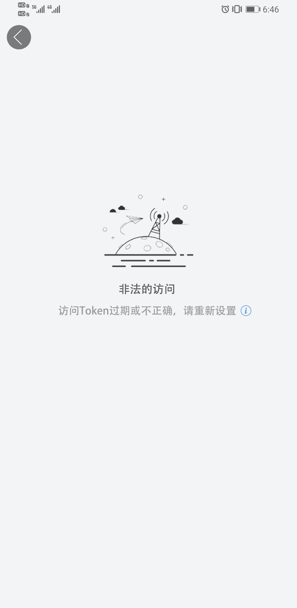

## 实战：接口拦截与路由处理

- 需求分析
- 效果演示
- Coding


### 需求分析

**访问需要登录的接口自动路由到登录页**

```java
int RC_NEED_LOGIN = 5003   //请先登录
int RC_USER_FORBID = 6001  //用户身份非法，如有疑问可进入课程官方群联系管理员
int RC_AUTH_TOKEN_EXPIRED = 4030 //访问Token过期，请重新设置
int RC_AUTH_TOKEN_INVALID = 4031 //访问Token不正确，请重新设置
```




### Coding

```java
 public boolean intercept(@NotNull Chain chain) {
        if (!chain.isRequestPeriod() && chain.response() != null) {
            HiResponse response = chain.response();
            int code = response.getCode();
            switch (code) {
                case 6001:
                case 4030:
                case 4031:
                    ARouter.getInstance().build("/degrade/global/activity")         
                      .withString("degrade_title","非法访问")

                      .withString("degrade_desc","访问Token过期或不正确，请重新设置")     
                      .withString("degrade_action","https://www.devio.org/io/as/html/api-help.html")
                      
                      .navigation()
                     
                    break;
            }
        }
```

