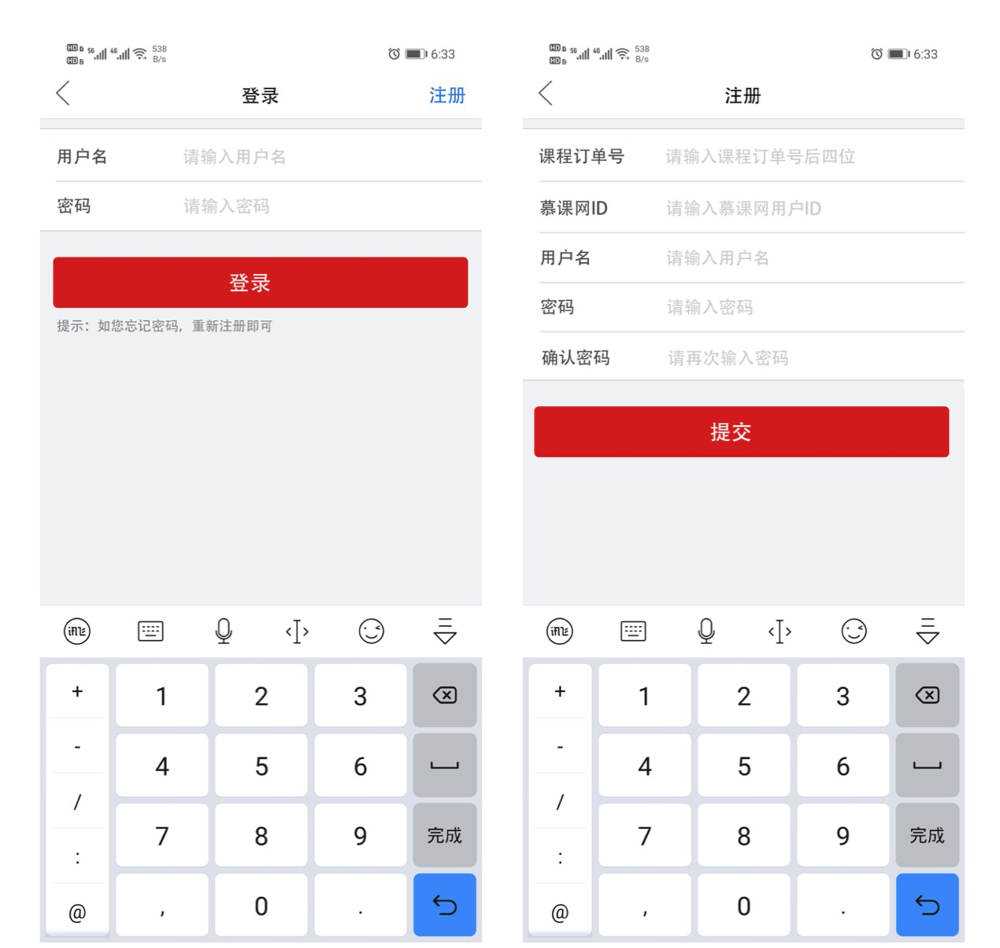

## 实战：注册登录模块

- 需求分析
- 效果实现
- Coding


### 需求分析




### 效果实现

- InputItemLayout

```java
<org.devio.as.proj.common.ui.view.InputItemLayout
      app:hint="请输入手机号"  
      app:inputType="text|number|password"
      app:title="用户名"
      app:inputTextAppearance="@style/inputTextAppearance"
      app:titleTextAppearance="@style/titleTextAppearance"
      app:topLineAppearance="@style/lineAppearance"
      app:bottomLineAppearance="@style/full_width_lineAppearance"
  >
```

- titleTextAppearance

```xml
 <declare-styleable name="titleTextAppearance">
        <attr name="titleColor" format="color"></attr>
        <attr name="titleSize" format="dimension"></attr>
        <attr name="minWidth" format="dimension"></attr>
    </declare-styleable>
```


- inputTextAppearance

```xml
 <declare-styleable name="inputTextAppearance">
        <attr name="hintColor" format="color"></attr>
        <attr name="inputColor" format="color"></attr>
        <attr name="textSize" format="dimension"></attr>
    </declare-styleable>
```


- lineAppearance

```xml
<declare-styleable name="lineAppearance">
        <attr name="color" format="color"></attr>
        <attr name="height" format="dimension"></attr>
        <attr name="leftMargin" format="dimension"></attr>
        <attr name="rightMargin" format="dimension"></attr>
        <attr name="enable" format="boolean"></attr>
    </declare-styleable>
```


- IconFontTextView

```java
public init() {
      Typeface typeface = Typeface.createFromAsset(context.assets, "fonts/iconfont.ttf")
      setTypeface(typeface)
}
```

